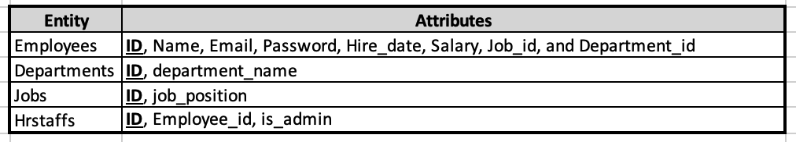
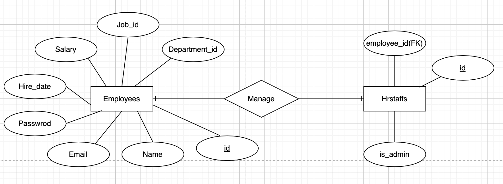
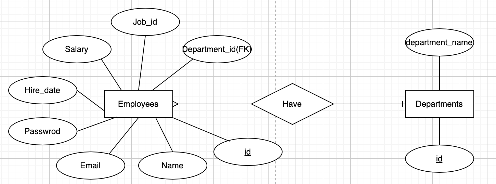
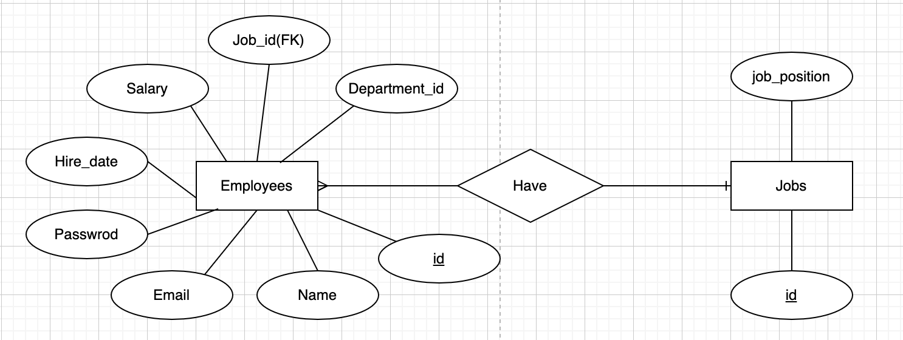

# API Web server for HR management
# R1 - Identification of the problem you are trying to solve by building this particular app.
The HR management system is used as an important tool for strategic personnel management. It is an integrated HR management system that helps effective decision-making through integrated data management. Support performance management of each employee and increase employee satisfaction.<br>Therefore, the HR department is intended to manage all employees in the company effectively. You can see at a glance the wages, job positions, dates of employment, and departments of workers. When a request to create, modify, or delete an employee from the frontend page of HR management system, each API in this application can manipulate the employee's data in the database.<br>
This application is accessible only to staffs working at the HR department. This is because there is sensitive private information of workers.

----
<br>

# R2 -Why is it a problem that needs solving?
A company that manages employees will have a demand to manage employees efficiently. There is a need for a management system that allows employees to focus on their work, such as employee's department movement, current salary, and current department.<br>
Without such a system, it becomes very difficult to respond when creating next year's budget, creating new departments, or eliminating existing departments.<br> Therefore, this application is needed for CEO or staff in the HR department to make decisions quickly and manage employees efficiently.

----
<br>

# R3 - Why have you chosen this database system. What are the drawbacks compared to others?
<br>
The most important characteristic of using a database to create a system is that it manages structured data. Data can be organised in columns such as 'ID' and 'password', sorted by some criteria, and filtered. Therefore, using the database to create this application is because adding/updating/deleting/retrieving data is more structured and faster. Among them, the reason RDB such as PostgreSQL was selected is that it is very suitable for the main database for providing service. In addition, <u>all the schema and db models of this application are fixed and will be used within the HR dapartment, so it does not need extremely high speed.</u> 
<br><br>

## comparison to No SQL database 

Because NoSQL is 'schemaless', data can be stored more flexibly, but RDBs used by this application rarely have schema change. On average, it is true that NoSQL is faster than RDB, and when using the same cost, NoSQL database is cost-effective in terms of performance. But this depends on which RDB you use.<br>
NoSQL is recommended when the exact data structure is unknown and data can be changed or expanded. However, if data duplication can occur, all collections must be modified when duplicate data is changed, so it is good for systems that do not have many updates. On the other hand, because RDB guarantees data integrity and is easy to change, it is suitable for this application where related data is frequently changed.

## Pros and Cons of RDB

### Benefits
As I mentioned above, data should be saved according to the established schema, ensuring a clear dta structure. There is no duplication of data, so data consistency can be guaranteed.

### Drawbacks
As the system grows, complex queries with many JOIN statement will make the system slow down. If you want to add columns in tables having a lot of data, you must alter table and create a new table. Moreover, improving hardware performance can be costly.

Reference: https://peps.python.org/pep-0008/ <br>
Reference: https://docs.rackspace.com/support/how-to/choosing-between-rdbms-and-nosql/
____
<br>

# R4 - Identify and discuss the key functionalities and benefits of an ORM
<br>

## What is ORM?
ORM(Object-Relational Mapping) is simply setting connections between objects in object_oriented programs and relational database. To use RDB, you must use SQL. However, ORM automatically converts the written Python code into a SQL query of the relational DB, allowing developers to manipulate the DB only by writing Python code without having to write a separate SQL query. For example, below is an example of a SQLAlchemy model definition. We create a class named Contact with SQLAlchemy
```py 
  class Contact(db.Model):
      __tablename__ = 'contacts'
      id = db.Column(db.Integer, primary_key=True)
      first_name = db.Column(db.String(100))
      last_name = db.Column(db.String(100))
      phone_number = db.Column(db.String(32)) 
```
If we do the migration, we can get a Contact table in Database even though we don't write any create table statement. 
```py
  CREATE TABLE CONTACTS(
      ID INT PRIMARY KEY        NOT NULL,
      FIRST_NAME     CHAR(100)  NOT NULL,
      LAST_NAME      CHAR(100)  NOT NULL,
      PHONE_NUMBER   CHAR(32)   NOT NULL,
);
```
Reference: https://www.fullstackpython.com/sqlalchemy.html<br><br>

SQLAlchemy handle the table creation by using ORM. IT can be seen a table create statement was created so that a table could be created just like the class.<br>
In addition, all records can be retrieved by using SQLAlchemy in Python code such as `contacts = Contact.query.all()` instead of a plain SQL, `SELECT * FROM contacts`. 

### Benefits of ORM
No need to create declaration, assignment in programs, so we can reduce development time. Once you write your data model, ORM creates Table automatically so we can improve the productivity. Also Model use OOP(Object-Oriented Programming), we can speed up development by extending and inheriting from Models. SQL injection is not easy as queries are sanitised.<br>

Reference: https://www.freecodecamp.org/news/what-is-an-orm-the-meaning-of-object-relational-mapping-database-tools/<br>
Reference: https://www.learnnowonline.com/blogs/2012/08/28/4-benefits-of-object-relational-mapping-orm<br>
Reference: https://midnite.uk/blog/the-pros-and-cons-of-object-relational-mapping-orm

----
<br>

# R5 - Document all endpoints for your API

<br>

- Login
  - HTTP request verb : POST
  - Required data where applicable : The email and password are needed in JSON
  - Expected response data : The email, encoded password and token using JWT
  - Authentication methods where applicable: n/a

<br>

- Get all HR staffs
  - HTTP request verb : GET
  - Required data where applicable : N/A
  - Expected response data : 'id', 'is_admin', 'employees', 'employee_id', 'email'
  - Authentication methods where applicable: N/A

<br>

- Add a new HR staff
  - HTTP request verb : POST
  - Required data where applicable : employee_id, is_admin
  - Expected response data : 'id', 'is_admin', 'employees', 'employee_id', 'email'
  - Authentication methods where applicable: Token by JWT

<br>

- Delete a HR staff
  - HTTP request verb : DELETE
  - Required data where applicable : id parameter
  - Expected response data : Delete confirmation message
  - Authentication methods where applicable: Token by JWT

<br>

- Update a HR staff
  - HTTP request verb : PUT
  - Required data where applicable : One of fields in hrstaffs table and id parameter- 
  - Expected response data : 'id', 'is_admin', 'employees', 'employee_id', 'email'
  - Authentication methods where applicable: Token by JWT

<br>

- Get all employees
  - HTTP request verb : GET
  - Required data where applicable : N/A
  - Expected response data : 'id', 'name', 'email', 'password', 'salary','hire_date', 'job_id', 'department_id', 'job', 'department'
  - Authentication methods where applicable: N/A
  
<br>

- Get a employee
  - HTTP request verb : GET
  - Required data where applicable : id parameter
  - Expected response data : 'id', 'name', 'email', 'password', 'salary','hire_date', 'job_id', 'department_id', 'job', 'department'
  - Authentication methods where applicable: N/A

<br>

- Add a new employee
  - HTTP request verb : POST
  - Required data where applicable : All fields of employees table
  - Expected response data : 'id', 'name', 'email', 'password', 'salary','hire_date', 'job_id', 'department_id', 'job', 'department'
  - Authentication methods where applicable: Token by JWT

<br>

- Delete a employee
  - HTTP request verb : DELETE
  - Required data where applicable : id parameter
  - Expected response data : Delete confirmation message
  - Authentication methods where applicable: Token by JWT

<br>

- Update a employee
  - HTTP request verb : PUT
  - Required data where applicable : fields of employees that need to update and id parameter
  - Expected response data : 'id', 'name', 'email', 'password', 'salary','hire_date', 'job_id', 'department_id', 'job', 'department'
  - Authentication methods where applicable: Token by JWT

<br>


- Get all department
  - HTTP request verb : GET
  - Required data where applicable : N/A
  - Expected response data : 'id', 'department_name'
  - Authentication methods where applicable: N/A

<br>

- Get a department
  - HTTP request verb : GET
  - Required data where applicable : id parameter
  - Expected response data : 'id', 'department_name'
  - Authentication methods where applicable: N/A

<br>


- Add a department
  - HTTP request verb : POST
  - Required data where applicable : fields in departments table
  - Expected response data : 'id', 'department_name'
  - Authentication methods where applicable: Token by JWT

<br>

- Delete a department
  - HTTP request verb : DELETE
  - Required data where applicable : id parameter
  - Expected response data : Delete confirmation message
  - Authentication methods where applicable: Token by JWT
  
<br>

- Update a department
  - HTTP request verb : PUT
  - Required data where applicable : fields of department table that need to update and id parameter
  - Expected response data : 'id', 'name', 'email', 'password', 'salary','hire_date', 'job_id', 'department_id', 'job', 'department'
  - Authentication methods where applicable: Token by JWT


<br>

- Get all jobs
  - HTTP request verb : GET
  - Required data where applicable : N/A
  - Expected response data : 'id', 'job_position'
  - Authentication methods where applicable: N/A

<br>

- Get a  job
  - HTTP request verb : GET
  - Required data where applicable : id parameter
  - Expected response data : 'id', 'job_position'
  - Authentication methods where applicable: N/A

<br>

- Add a new job
  - HTTP request verb : POST
  - Required data where applicable : All fields in jobs table
  - Expected response data : 'id', 'job_position'
  - Authentication methods where applicable: Token by JWT

<br>

- Update a job
  - HTTP request verb : PUT
  - Required data where applicable : fields in jobs table need to update
  - Expected response data : 'id', 'job_position',
  - Authentication methods where applicable: Token by JWT

<br>

- Delete a job
  - HTTP request verb : DELETE
  - Required data where applicable : id parameter
  - Expected response data : Delete confirmation message
  - Authentication methods where applicable: Token by JWT

<br>

## Documentation of all endpoints By POSTMAN
I created documentation of all endpoints by using POSTMAN.

[Documentation By POSTMAN](https://documenter.getpostman.com/view/18820618/2s8YekQurc)


----
<br>

# R6. An ERD for your app

<br>

# Database Modeling 

<br>

## Analyse the requirements of my application

<br>

```
   - Employees has Name, Email, Password, Hire_date, Salary, Job_id, and Department_id
   - Department has department_name
   - Job has job_position
   - HR staffs have employee_id, is_admin
   - Department has many employees 
   - Job_position be assigned to many employees
   - Only Employees in HR department can register in HR staff
```
<br>

## Conceptual Data Model

<br>

- We can create Conceptual data model based on the requirements analysis by extracting entities and attributes.
<br>



### Why did each entities have this structure?
<br>

### Employees
  The HR management system requires personal information of employees, 'salary' for annual salary management, 'job_position' for promotion management, 'department_id' for career management, and 'hire_date' information. Therefore, the employees entity which is the main entity of the HR management system is managed with this structured data.
<br>

### Departments
For employees' movement between departments and career management, department entity has ID(PK), department_name.

### Jobs
For promotion management and career management of employees, ID(PK), job_position attribute is in the jobs entity

### Hrstaffs
It is necessary to manage the HR management system by registering the staff in HR department. Therefore, hrstaffs has ID(PK), 'employee_id' and 'is_admin' attributes

<br>

----
<br>

Establish a relationship between the entities based on the entities and the requirements above


<br>

### Cardinality
<br>

### [Hrstaffs] : [Employees] = 1 : 1

<br>

The hrstaff entity is created in the employee entity. Only employees who work in the HR department among those registered in the employee entity are registered in hrstaffs entity. Thus, the relationship between both is bound to `1:1`.

<br>



<br>

### [Departments] : [Employees] = 1 : N

<br>

As I mentioned in the requirements analysis, a department has multiple employees. So this relationship is represented as `1:N`. The department entity becomes the parent and the employee becomes the child.

<br>



<br>

### [Jobs] : [Employees] = 1 : N</u>

<br>

The relationship between job entity and employee entity is also `1:N`. Because one job position has lots of employees. Similarly, jobs entity is the parent and employees entity becomes the child.

<br>



## Logical Data Model

<br>


<br>
So the entire ERD is generated as above.

<br>

## Physical Data Model

<br>

The physical model will be described in Requirement R8.

Reference: https://www.lucidchart.com/pages/er-diagrams

-----

# R7. Detail any third party services that your app will use

## Flask_Bcrypt

<br>

Flask Bcrypt is called as a flask extension that allows us to use hashing functions. This is for protecting password using hashing function. In addition, we improved the vulnerability of existing hash functions and prepared for hacking such as rainbow attack. Methods such as salting and key stretching can be added here to encrypt deeper and secure personal information more reliably. This Bcrypt was used in my application to encrypt passwords in the employees table.

Reference: https://www.educba.com/flask-bcrypt/

## Flask-JWT-Extended

<br>

JWT stands for JSON Web Token. When a user logs in, how to keep login status has developed in various ways. The next step after cookies and sessions is the token-based user authentication method using JWT.
It is a method of simply putting information that can identify user information in the token and using this JWT token when authentication is required. It consists of header, payload, and signature. Header and payload can be decoded and checked by anyone, so do not include information such as user's 
password. VerifySignature cannot be decrypted without knowing the secret key.

<br>


## Process of JWT

- A Server receives a token and verify if signature is valid
- If it is considered valid, decode the claim set and open the data contained in the token
- It contains the expiration time, so check if the token is available and use it immediately if there is no problem

In my application, I used it to check whether user is an staff of HR team in the API that has features of 'update', 'delete', and 'insert',

Reference: https://github.com/vimalloc/flask-jwt-extended <br>
Reference: https://4geeks.com/lesson/what-is-JWT-and-how-to-implement-with-Flask


## Flask-marshmallow

<br>

Marshmallow is a utility that helps serialize, de-serialize, and validate Python objects. For example, you can use it to validate the payload of POST requests that come into the web server, or to convert Python objects to JSON to return them to response. Briefly, Deserialize input data to app-level objects. Serialize the objects to primitive Python types. The serialized objects can then be rendered to standard formats such as JSON for use in an HTTP API.

Reference: https://github.com/marshmallow-code/marshmallow

## Flask-SQLAlchemy
<br>

SQlAlchemy is one of the ORMs available on Python. SQL had to be written to fetch the desired data from the database, but there is an ORM that replaces the SQL role in the application. In fact, you can connect to the database in the application and manage the data with only code without executing the query. In this way, SQLAlchemy interprets the Python class as a table in RDB and converts the language of SQL Alchemy similar to Python into SQL. It also makes connection of the database easier and automatically provides maintenance for the connection. In my application, models of each table and statements to manage DB's data in each API are used.

<br>

```py 
class Employee(db.Model):
    __tablename__ = 'employees'
    
    id = db.Column(db.Integer, primary_key=True)
    name = db.Column(db.String(100), nullable=False)
    email = db.Column(db.String, nullable=False, unique=True)
    password = db.Column(db.String, nullable=False)
    hire_date = db.Column(db.Date)
    salary = db.Column(db.Integer)
```

Reference: https://www.digitalocean.com/community/tutorials/how-to-use-flask-sqlalchemy-to-interact-with-databases-in-a-flask-application<br>


## pip-review

<br>

pip-review is a python library that updates the currently installed pip list to the latest list. Run `pip-review` to display a list of packages with the latest version released. Then, run `pip-review -aC `to install the latest version of the currently installed pip list. As I learned in class, I check the latest version with `pip-review` before creating requirements.txt.

Reference: https://pypi.org/project/pip-review/<br>
Reference: https://stackabuse.com/python-update-all-packages-with-pip-review/

## psycopg2

<br>

Psycopg2 is a adapter that is used between PostgreSQL DB and flask application. In my applicationm, this is applied for connectiong postgreSQL. <br>
`DATABASE_URL=postgresql+psycopg2://{user ID}:{password}}@127.0.0.1:5432/t2a2_db`

## python-dotenv
<br>
This Python module takes its configuration from environment variables. In other word, Rather than hardcoded sensitive information such as API key and db access information are put in the source code directrly, it is stored separately in `.env` using an environment variable paired with key and value.

<br>

In my application, if you have a look at `main.py` 

```py
app.config['SQLALCHEMY_DATABASE_URI'] = os.environ.get('DATABASE_URL')
    app.config['JWT_SECRET_KEY'] = os.environ.get('JWT_SECRET_KEY')
```
DB access information and set_key information are stored separately in `.env` file using an environment variable.
```py 
DATABASE_URL=postgresql+psycopg2://{user ID}:{password}}@127.0.0.1:5432/t2a2_db
```

------

# R8. Describe your projects models in terms of the relationships they have with each other

Employee
모델 스크린샷 - sqlalchemy.
이 테이블과 참조가 일어나는 tabel은 뭐고 포린키는 어떻게 작동되고 포린키 제약조건은 뭔지
back populating과 부모 자식간의 관계 설명


----

# R9. Discuss the database relations to be implemented in your application

<br>

model 정의한거 스크린샷하고 그 필드에 대해서 설명하고, 이것이 sql alchemy가 실제로 어떻게 작동하는지, card와 user간에 어떤 참조가 발생하는지? 데이터 베이스안에서 어떤 관계가 존재하는지? foreign key constraint 이 무엇인지? sql alchemy 모델에서 컬럼에 있는 foreign Key 제약조건을 뭘 나타내는지? back_populating과 foreign key method()에 대해서 설명. postgreSQL에서 부모, 자식, set/lists/collection types에 대해서 설명. 1-m, m-m., 1-1 관계에 대해서 설명


---

# R10. Describe the way tasks are allocated and tracked in your project

----
